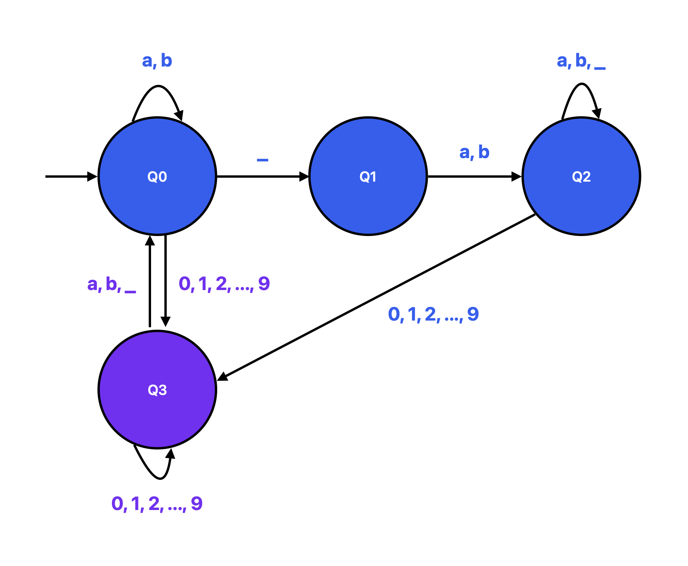
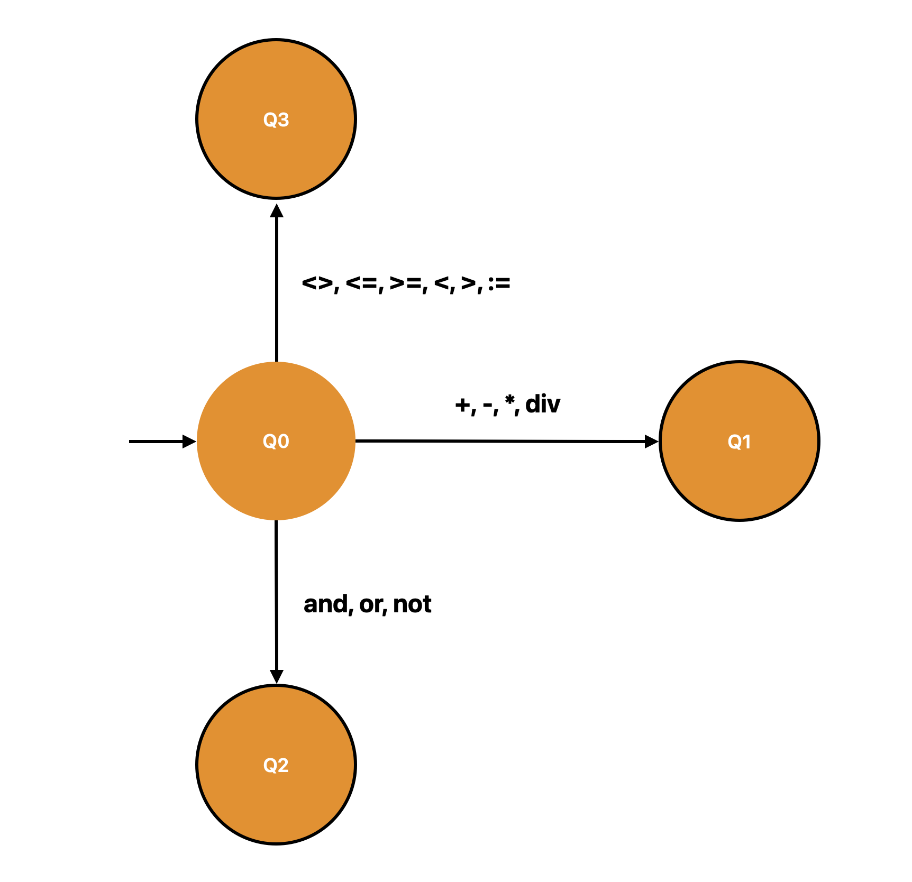
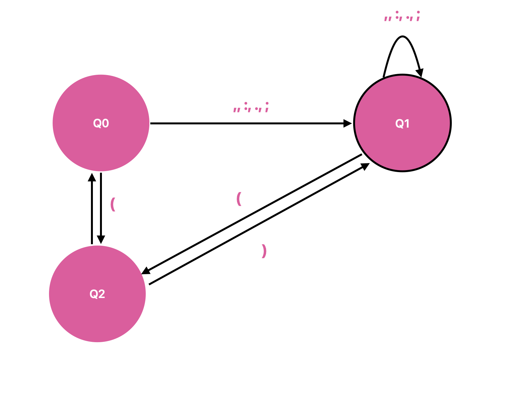
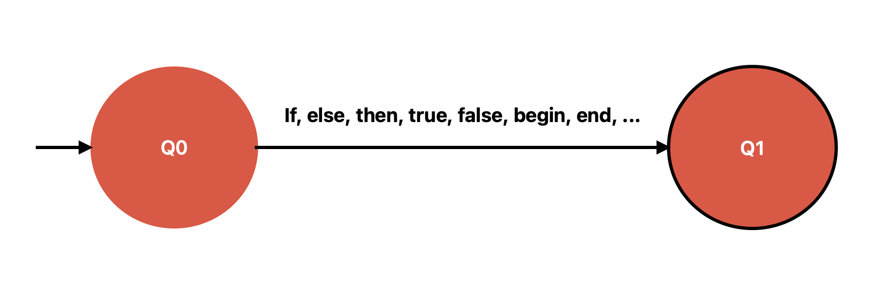

# Apresentação
A seguir estão apresentadas a gramática da linguagem **MiniPascal** e as especificações léxicas da linguagem, onde são definidos os seus átomos.

# Comentários
Aparecem delimitados por `/*` e `*/` e tudo que está entre estes identificadores é ignorado pela linguagem.

<details>
<summary>
    <code><b>afn</b></code>
</summary>


</details>  

**Expressão Regular:**

```nasm
/* ( a | b )* */
```

**Gramática Livre de Contexto (GLC):**

```nasm
S -> /*C*/
C -> aC | bC | ε
```

# Identificadores (Variáveis)
Podem ser criados com caracteres alfanuméricos e o caractere `_`. Não pode começar com um número, apenas por uma letra ou `_`  e é seguido por zero ou mais letras, dígitos ou `_`.

<details>
<summary>
    <code>
        <b>afn</b>
    </code>
</summary>



</details> 
<br>

**Expressão Regular:**

```nasm
( a | b | _ )( a | b | _ | 1 | 2 | 3 | 4 | 5 | 6 | 7 | 8 | 9 | 0 )*
```

**Gramática Livre de Contexto (GLC):**

```nasm
S -> C A
C -> a | b | _
A -> C | D | ε
D -> 0 | 1 | 2 | 3 | 4 | 5 | 6 | 7 | 8 | 9
```

# Operadores
Os operadores utilizados pela linguagem são: `+`, `-`, `div`, `*`, `and`, `or`, `not`, `<`, `>`, `<>`, `<=`, `>=`, `:=`.

<details>
<summary>
    <code>
        <b>afn</b>
    </code>
</summary>



</details> 
<br>

**Expressão Regular:**

```nasm
( + | - | * | div | and | or | not | <> | <= | >= | < | > | := )
```

**Gramática Livre de Contexto (GLC):**

```nasm
S -> R | L | O
R -> + | - | * | div
L -> and | or | not
O -> <> | <= | >= | < | > | :=
```

# Delimitadores
Os delimitadores utilizados pela linguagem são: `(`, `)`, `,`, `:`, `.`, `;`.

<details>
<summary>
    <code>
        <b>afn</b>
    </code>
</summary>



</details> 
<br>

**Expressão Regular:**

```nasm
( ( | ) | , | : | . | ; )
```

**Gramática Livre de Contexto (GLC):**

```nasm
S -> ( | ) | , | : | . | ;
```


# Palavras Reservadas

As palavras reservadas pela linguagem são:

`program` `if` `do` `var` `false` `begin` `then` `and` `integer` `write` `end` `else` `or` `boolean` `procedure` `while` `not` `true`

<details>
<summary>
    <code>
        <b>afn</b>
    </code>
</summary>



</details> 
<br>

**Expressão Regular (ER):**

```nasm
( program | if | do | var | false | begin | then | and | integer | write | end | else | or | boolean | procedure | while | not | true )
```

**Gramática Livre de Contexto (GLC):**

```nasm
S -> C | B | A | LO | L | T | O
C -> if | else | then
B -> true | false
A -> begin | end
LO -> while | do
L -> and | or | not
T -> var | integer
O -> program | write
```
