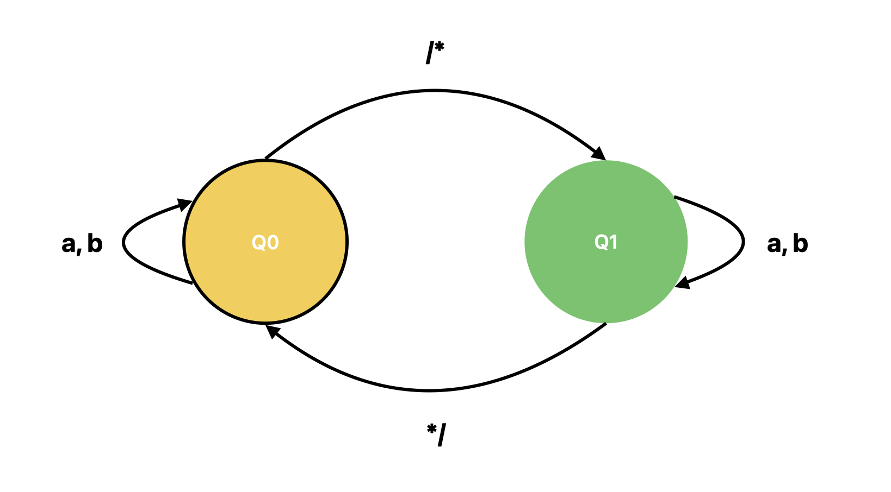

# Apresentação

A seguir estão apresentadas a gramática da linguagem **MiniPascal** e as especificações léxicas da linguagem, onde são definidos os seus átomos.

# Comentários

Aparecem delimitados por `/*` e `*/` e tudo que está entre estes identificadores é ignorado pela linguagem.

<details>
<summary>
    <code>
        <b>afn</b>
    </code>
</summary>



</details>  

**Expressão Regular:**

```nasm
/* ( a | b )* */
```

**Gramática Livre de Contexto (GLC):**

```nasm
S -> /*C*/
C -> aC | bC | ε
```

# Identificadores (Variáveis)

Podem ser criados com caracteres alfanuméricos e o caractere `_`. Não pode começar com um número, apenas por uma letra ou `_`  e é seguido por zero ou mais letras, dígitos ou `_`.


# Operadores

Os operadores utilizados pela linguagem são: `+`, `-`, `div`, `*`, `and`, `or`, `not`, `<`, `>`, `<>`, `<=`, `>=`, `:=`.

# Delimitadores

Os delimitadores utilizados pela linguagem são: `(`, `)`, `,`, `:`, `.`, `;`.

# Palavras Reservadas

As palavras reservadas pela linguagem são:

`program` `if` `do` `var` `false` `begin` `then` `and` `integer` `write` `end` `else` `or` `boolean` 

`procedure` `while` `not` `true`